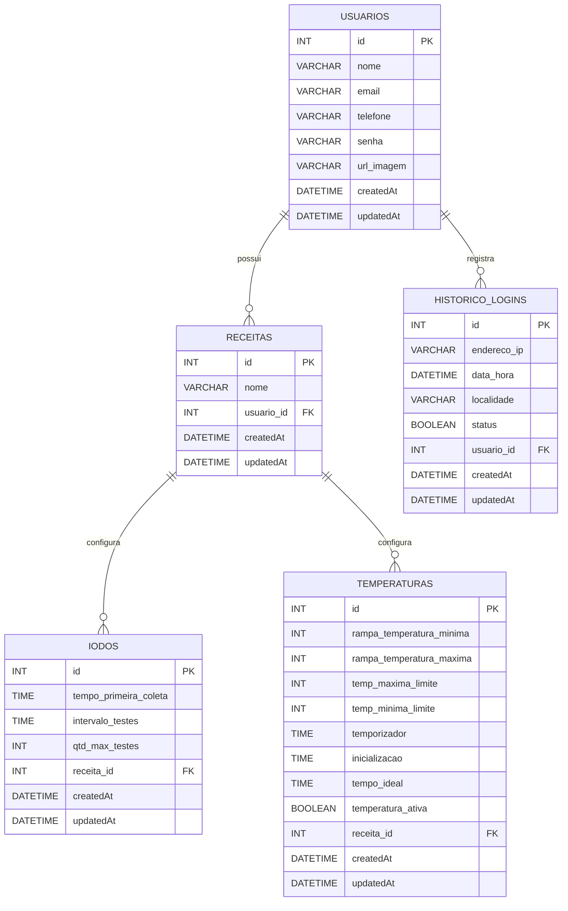

# Banco de Dados — MASH

Documentação do banco de dados utilizado pelo projeto **MASH**, desenvolvido no contexto do Projeto Integrador do curso de Desenvolvimento de Software Multiplataforma da FATEC Registro.

O esquema abaixo representa o **estado atual do backend**, com base nos models Sequelize existentes no projeto.

---

## Tecnologias

- **MySQL**
- **Sequelize ORM**
- **Node.js**

A configuração atual do backend utiliza:

- Dialeto: `mysql`
- Host: `localhost`
- Banco: `cervejaria`
- Timezone: `-03:00`

> **Importante:** credenciais de banco não devem ser versionadas no repositório. Em produção, utilize variáveis de ambiente para host, usuário, senha e nome do banco.

---

## Estrutura atual

O banco possui cinco entidades principais:

| Tabela | Finalidade |
|---|---|
| `usuarios` | Armazena os usuários do sistema |
| `receitas` | Armazena as receitas cadastradas pelos usuários |
| `iodos` | Armazena as configurações do teste de iodo de uma receita |
| `temperaturas` | Armazena as configurações de temperatura associadas a uma receita |
| `Historico_Logins` | Armazena registros de acesso dos usuários |

Como os timestamps do Sequelize não foram desativados, as tabelas também utilizam os campos:

- `id`
- `createdAt`
- `updatedAt`

---

## Diagrama MER



### Cardinalidades

| Relacionamento | Cardinalidade | Regra |
|---|---|---|
| `usuarios` → `receitas` | `1 : 0..N` | Um usuário pode não possuir receita ou possuir várias |
| `usuarios` → `Historico_Logins` | `1 : 0..N` | Um usuário pode possuir vários registros de acesso |
| `receitas` → `iodos` | `1 : 0..N` | Uma receita pode possuir vários registros/configurações de iodo |
| `receitas` → `temperaturas` | `1 : 0..N` | Uma receita pode possuir vários registros/configurações de temperatura |

Cada registro filho possui uma chave estrangeira obrigatória. Portanto:

- toda `receita` pertence a exatamente um `usuario`;
- todo registro de `iodo` pertence a exatamente uma `receita`;
- todo registro de `temperatura` pertence a exatamente uma `receita`;
- todo registro de `Historico_Logins` pertence a exatamente um `usuario`.

---

## Entidades

### `usuarios`

| Campo | Tipo | Nulo | Chave |
|---|---|---:|---|
| `id` | `INT` | Não | PK |
| `nome` | `VARCHAR(255)` | Não | |
| `email` | `VARCHAR(255)` | Não | |
| `telefone` | `VARCHAR(255)` | Sim | |
| `senha` | `VARCHAR(255)` | Não | |
| `url_imagem` | `VARCHAR(255)` | Sim | |
| `createdAt` | `DATETIME` | Não | |
| `updatedAt` | `DATETIME` | Não | |

---

### `receitas`

| Campo | Tipo | Nulo | Chave / referência |
|---|---|---:|---|
| `id` | `INT` | Não | PK |
| `nome` | `VARCHAR(255)` | Não | |
| `usuario_id` | `INT` | Não | FK → `usuarios.id` |
| `createdAt` | `DATETIME` | Não | |
| `updatedAt` | `DATETIME` | Não | |

A relação `receitas.usuario_id → usuarios.id` não possui `ON DELETE CASCADE` definido no model atual.

---

### `iodos`

| Campo | Tipo | Nulo | Chave / referência |
|---|---|---:|---|
| `id` | `INT` | Não | PK |
| `tempo_primeira_coleta` | `TIME` | Não | |
| `intervalo_testes` | `TIME` | Não | |
| `qtd_max_testes` | `INT` | Não | |
| `receita_id` | `INT` | Não | FK → `receitas.id` |
| `createdAt` | `DATETIME` | Não | |
| `updatedAt` | `DATETIME` | Não | |

Ao excluir uma receita, seus registros relacionados de iodo são removidos por `ON DELETE CASCADE`.

---

### `temperaturas`

| Campo | Tipo | Nulo | Chave / referência |
|---|---|---:|---|
| `id` | `INT` | Não | PK |
| `rampa_temperatura_minima` | `INT` | Não | |
| `rampa_temperatura_maxima` | `INT` | Não | |
| `temp_maxima_limite` | `INT` | Não | |
| `temp_minima_limite` | `INT` | Não | |
| `temporizador` | `TIME` | Não | |
| `inicializacao` | `TIME` | Não | |
| `tempo_ideal` | `TIME` | Não | |
| `temperatura_ativa` | `BOOLEAN` | Não | |
| `receita_id` | `INT` | Não | FK → `receitas.id` |
| `createdAt` | `DATETIME` | Não | |
| `updatedAt` | `DATETIME` | Não | |

`temperatura_ativa` utiliza `false` como valor padrão.

Ao excluir uma receita, seus registros relacionados de temperatura são removidos por `ON DELETE CASCADE`.

---

### `Historico_Logins`

| Campo | Tipo | Nulo | Chave / referência |
|---|---|---:|---|
| `id` | `INT` | Não | PK |
| `endereco_ip` | `VARCHAR(255)` | Não | |
| `data_hora` | `DATETIME` | Não | |
| `localidade` | `VARCHAR(255)` | Não | |
| `status` | `BOOLEAN` | Sim | |
| `usuario_id` | `INT` | Não | FK → `usuarios.id` |
| `createdAt` | `DATETIME` | Não | |
| `updatedAt` | `DATETIME` | Não | |

`data_hora` utiliza a data e hora atuais como valor padrão.

Ao excluir um usuário, seus registros de histórico de login são removidos por `ON DELETE CASCADE`.

---

## Integridade referencial

As chaves estrangeiras atuais são:

```text
receitas.usuario_id
    → usuarios.id

iodos.receita_id
    → receitas.id

temperaturas.receita_id
    → receitas.id

Historico_Logins.usuario_id
    → usuarios.id
```

Resumo visual:

```text
USUARIO
   │
   ├── 1 : 0..N ── RECEITA
   │                  │
   │                  ├── 1 : 0..N ── IODO
   │                  │
   │                  └── 1 : 0..N ── TEMPERATURA
   │
   └── 1 : 0..N ── HISTORICO_LOGIN
```

---

## Script SQL

O arquivo principal do schema é:

```text
mash_modelo_atual.sql
```

Ele contém:

- criação do banco `cervejaria`;
- criação das tabelas;
- chaves primárias;
- chaves estrangeiras;
- índices das relações;
- regras de exclusão em cascata existentes nos models.

### Executar pelo MySQL

```bash
mysql -u root -p < mash_modelo_atual.sql
```

Ou, caso o banco já exista:

```bash
mysql -u root -p cervejaria < mash_modelo_atual.sql
```

Também é possível executar o script utilizando ferramentas como:

- MySQL Workbench
- DBeaver
- DataGrip

---

## Arquivos do banco

Organização recomendada:

```text
database/
├── README.md
├── mash_modelo_atual.sql
├── diagrama_mer_mash.png
├── diagrama_mer_mash.svg
└── diagrama_mer_mash.mmd
```

### Arquivos do MER

- `diagrama_mer_mash.png`: versão para visualização rápida e documentação;
- `diagrama_mer_mash.svg`: versão vetorial;
- `diagrama_mer_mash.mmd`: versão editável em Mermaid.

Se desejar exibir também a imagem exportada no README:

```md

```

---

## Escopo atual do Projeto Integrador

Este banco representa o **estado atual do backend**.

O foco acadêmico atual do Projeto Integrador é a **verificação do teste do iodo por visão computacional**.

O model atual de `iodos` armazena somente informações de configuração do teste:

- tempo da primeira coleta;
- intervalo entre testes;
- quantidade máxima de testes;
- receita associada.

Ainda não existem, no schema atual, entidades próprias para armazenar:

- lote de produção;
- imagem capturada do teste;
- resultado da análise (`passou` / `não passou`);
- data e hora de cada análise;
- nível de confiança;
- histórico das análises realizadas.

Essas estruturas devem ser adicionadas ao banco apenas quando forem implementadas no backend, mantendo o schema, os models e a documentação sincronizados.

---

## Boas práticas

Para evolução do banco:

1. Versionar alterações estruturais por meio de migrations.
2. Não armazenar credenciais diretamente no código.
3. Utilizar variáveis de ambiente para dados de conexão.
4. Não armazenar senhas em texto puro.
5. Utilizar hash seguro para senhas.
6. Manter índices nas chaves estrangeiras.
7. Validar constraints no banco e também na aplicação.
8. Atualizar este README e o MER quando o schema for alterado.
9. Evitar alterações manuais diretamente no banco de produção.

---

## Observação sobre o Sequelize

Os models atuais não desativam os timestamps do Sequelize. Por isso, `createdAt` e `updatedAt` fazem parte do schema documentado.

O nome `Historico_Logins` segue a pluralização padrão aplicada ao model `Historico_Login`.

Caso futuramente sejam utilizadas opções como:

```js
timestamps: false
freezeTableName: true
underscored: true
```

o schema e esta documentação deverão ser revisados.

---

**Projeto Integrador — FATEC Registro**  
**Desenvolvimento de Software Multiplataforma**
