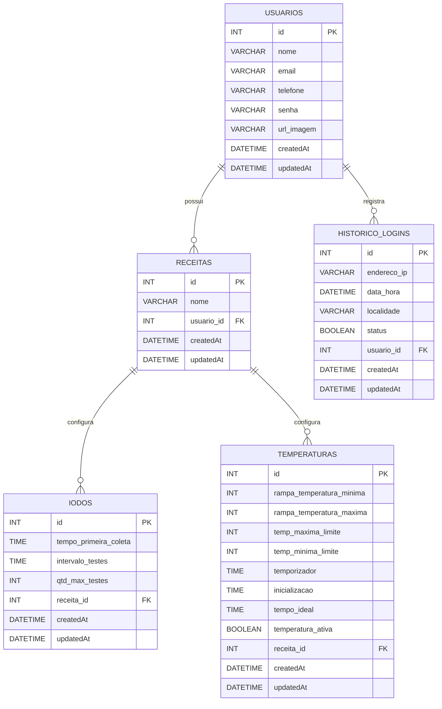

# Banco de Dados — MASH

Documentação do banco de dados utilizado pelo projeto **MASH**, desenvolvido no Projeto Integrador do curso de Desenvolvimento de Software Multiplataforma da FATEC Registro.

> **Status:** este documento descreve o **schema atual do backend**, com base nos models Sequelize existentes no projeto. Ele não representa, necessariamente, o modelo final previsto para as próximas etapas do Projeto Integrador.

---

## Tecnologias

- **MySQL**
- **Sequelize ORM**
- **Node.js**

A configuração local atual utiliza:

```text
Dialect: mysql
Host: localhost
Database: cervejaria
Timezone: -03:00
```

> Credenciais de banco não devem ser mantidas no código em ambientes reais. Utilize variáveis de ambiente para usuário, senha, host e nome do banco.

---

## Escopo atual

O banco possui cinco entidades principais:

| Tabela | Finalidade |
|---|---|
| `usuarios` | Armazena os usuários do sistema |
| `receitas` | Armazena as receitas cadastradas pelos usuários |
| `iodos` | Armazena a configuração do teste de iodo associada a uma receita |
| `temperaturas` | Armazena configurações de temperatura associadas a uma receita |
| `Historico_Logins` | Armazena registros de acesso dos usuários |

Os models atuais não desativam os timestamps padrão do Sequelize. Por isso, as tabelas também possuem:

- `id`
- `createdAt`
- `updatedAt`

### Observação sobre o Projeto Integrador

O **recorte acadêmico atual** do Projeto Integrador está focado no **teste do iodo por visão computacional**.

A tabela `temperaturas` permanece documentada porque existe no backend atual, mas não faz parte do foco acadêmico principal desta etapa.

---

# Diagrama MER

O GitHub renderiza o diagrama abaixo automaticamente por meio de Mermaid.



## Cardinalidades

| Relacionamento | Cardinalidade | Regra |
|---|---|---|
| `usuarios` → `receitas` | `1 : 0..N` | Um usuário pode não possuir receitas ou possuir várias |
| `usuarios` → `Historico_Logins` | `1 : 0..N` | Um usuário pode possuir zero ou vários registros de acesso |
| `receitas` → `iodos` | `1 : 0..N` | Uma receita pode possuir zero ou vários registros de configuração do teste de iodo |
| `receitas` → `temperaturas` | `1 : 0..N` | Uma receita pode possuir zero ou vários registros de temperatura |

No lado filho, as chaves estrangeiras são obrigatórias. Portanto:

- cada `receita` pertence a exatamente um `usuario`;
- cada registro de `iodo` pertence a exatamente uma `receita`;
- cada registro de `temperatura` pertence a exatamente uma `receita`;
- cada registro de `Historico_Logins` pertence a exatamente um `usuario`.

---

# Estrutura das tabelas

## `usuarios`

| Campo | Tipo | Nulo | Chave |
|---|---|---:|---|
| `id` | `INT` | Não | PK |
| `nome` | `VARCHAR(255)` | Não | |
| `email` | `VARCHAR(255)` | Não | |
| `telefone` | `VARCHAR(255)` | Sim | |
| `senha` | `VARCHAR(255)` | Não | |
| `url_imagem` | `VARCHAR(255)` | Sim | |
| `createdAt` | `DATETIME` | Não | |
| `updatedAt` | `DATETIME` | Não | |

> No model atual, `email` ainda não possui constraint `UNIQUE`. Caso o e-mail seja utilizado como identificador de login, recomenda-se adicionar essa restrição em uma migration futura.

---

## `receitas`

| Campo | Tipo | Nulo | Chave / referência |
|---|---|---:|---|
| `id` | `INT` | Não | PK |
| `nome` | `VARCHAR(255)` | Não | |
| `usuario_id` | `INT` | Não | FK → `usuarios.id` |
| `createdAt` | `DATETIME` | Não | |
| `updatedAt` | `DATETIME` | Não | |

A relação `receitas.usuario_id → usuarios.id` **não possui `ON DELETE CASCADE`** definido no model atual.

---

## `iodos`

| Campo | Tipo | Nulo | Chave / referência |
|---|---|---:|---|
| `id` | `INT` | Não | PK |
| `tempo_primeira_coleta` | `TIME` | Não | |
| `intervalo_testes` | `TIME` | Não | |
| `qtd_max_testes` | `INT` | Não | |
| `receita_id` | `INT` | Não | FK → `receitas.id` |
| `createdAt` | `DATETIME` | Não | |
| `updatedAt` | `DATETIME` | Não | |

Ao excluir uma receita, seus registros relacionados de iodo são removidos por `ON DELETE CASCADE`.

> Atualmente esta tabela representa **configuração do teste de iodo**, e não a execução ou o resultado da análise por visão computacional.

---

## `temperaturas`

| Campo | Tipo | Nulo | Chave / referência |
|---|---|---:|---|
| `id` | `INT` | Não | PK |
| `rampa_temperatura_minima` | `INT` | Não | |
| `rampa_temperatura_maxima` | `INT` | Não | |
| `temp_maxima_limite` | `INT` | Não | |
| `temp_minima_limite` | `INT` | Não | |
| `temporizador` | `TIME` | Não | |
| `inicializacao` | `TIME` | Não | |
| `tempo_ideal` | `TIME` | Não | |
| `temperatura_ativa` | `BOOLEAN` | Não | |
| `receita_id` | `INT` | Não | FK → `receitas.id` |
| `createdAt` | `DATETIME` | Não | |
| `updatedAt` | `DATETIME` | Não | |

`temperatura_ativa` utiliza `false` como valor padrão.

Ao excluir uma receita, seus registros relacionados de temperatura são removidos por `ON DELETE CASCADE`.

---

## `Historico_Logins`

| Campo | Tipo | Nulo | Chave / referência |
|---|---|---:|---|
| `id` | `INT` | Não | PK |
| `endereco_ip` | `VARCHAR(255)` | Não | |
| `data_hora` | `DATETIME` | Não | |
| `localidade` | `VARCHAR(255)` | Não | |
| `status` | `BOOLEAN` | Sim | |
| `usuario_id` | `INT` | Não | FK → `usuarios.id` |
| `createdAt` | `DATETIME` | Não | |
| `updatedAt` | `DATETIME` | Não | |

`data_hora` utiliza a data e hora atuais como valor padrão.

Ao excluir um usuário, seus registros de histórico de login são removidos por `ON DELETE CASCADE`.

> O nome `Historico_Logins` segue a pluralização esperada do model `Historico_Login`. Como nomes de tabela podem apresentar diferenças de sensibilidade a maiúsculas e minúsculas entre ambientes MySQL, recomenda-se padronizar nomes em minúsculas em uma futura migration.

---

# Integridade referencial

As relações atuais são:

```text
receitas.usuario_id
    → usuarios.id

iodos.receita_id
    → receitas.id

temperaturas.receita_id
    → receitas.id

Historico_Logins.usuario_id
    → usuarios.id
```

Resumo:

```text
USUARIO
   │
   ├── 1 : 0..N ── RECEITA
   │                  │
   │                  ├── 1 : 0..N ── IODO
   │                  │
   │                  └── 1 : 0..N ── TEMPERATURA
   │
   └── 1 : 0..N ── HISTORICO_LOGIN
```

---

# Script SQL

O arquivo principal do schema é:

```text
mash_modelo_atual.sql
```

Ele contém:

- criação do banco `cervejaria`;
- criação das tabelas;
- chaves primárias;
- chaves estrangeiras;
- índices das relações;
- regras de exclusão em cascata existentes nos models.

## Atenção: script destrutivo

O script atual contém comandos `DROP TABLE IF EXISTS`.

Isso significa que ele **remove as tabelas existentes antes de recriá-las**.

> Utilize o script somente em ambiente local, acadêmico, de desenvolvimento ou em uma base descartável. Não execute diretamente em produção ou em um banco que contenha dados que precisam ser preservados.

---

# Executando localmente

## Pelo terminal

```bash
mysql -u root -p < mash_modelo_atual.sql
```

Como o próprio script cria e seleciona o banco `cervejaria`, não é necessário criá-lo manualmente antes da execução.

Também é possível utilizar:

- MySQL Workbench
- DBeaver
- DataGrip

---

# Arquivos do banco

Estrutura recomendada no repositório:

```text
database/
├── README.md
├── mash_modelo_atual.sql
├── diagrama_mer_mash.png
├── diagrama_mer_mash.svg
└── diagrama_mer_mash.mmd
```

## Arquivos do MER

| Arquivo | Finalidade |
|---|---|
| `diagrama_mer_mash.png` | Visualização rápida |
| `diagrama_mer_mash.svg` | Versão vetorial |
| `diagrama_mer_mash.mmd` | Fonte editável em Mermaid |

A versão PNG também pode ser exibida no README:

```md

```

---

# Evolução prevista para o teste do iodo

O model atual de `iodos` armazena apenas:

- tempo da primeira coleta;
- intervalo entre testes;
- quantidade máxima de testes;
- receita associada.

Para atender completamente ao fluxo de visão computacional previsto no Projeto Integrador, o banco deverá futuramente contemplar estruturas para registrar, quando essas funcionalidades forem implementadas:

- lote de produção;
- execução individual do teste;
- imagem capturada;
- data e hora da análise;
- resultado `passou` / `não passou`;
- nível de confiança da classificação;
- histórico das análises.

Essas estruturas **não fazem parte do schema atual** e não devem ser documentadas como implementadas antes de existirem no backend.

---

# Boas práticas para evolução

1. Utilizar **migrations do Sequelize** para alterações de estrutura.
2. Não armazenar credenciais diretamente no código.
3. Utilizar variáveis de ambiente para configuração do banco.
4. Nunca armazenar senhas em texto puro.
5. Utilizar hash seguro para senhas.
6. Manter índices nas chaves estrangeiras.
7. Aplicar validações tanto no banco quanto na aplicação.
8. Atualizar o MER e este README sempre que o schema for alterado.
9. Evitar alterações manuais diretamente no banco de produção.
10. Criar backup antes de qualquer migration destrutiva.

---

# Pontos de atenção do schema atual

Os itens abaixo refletem o estado atual dos models e podem ser tratados em evoluções futuras:

- `email` ainda não possui `UNIQUE`;
- o nome `Historico_Logins` não segue o mesmo padrão de caixa das demais tabelas;
- o arquivo de configuração local ainda deve ser migrado para variáveis de ambiente antes de uso fora do desenvolvimento;
- `iodos` ainda não registra resultados reais das análises;
- `temperaturas` permanece no backend, embora esteja fora do foco acadêmico principal desta etapa.

---

**Projeto Integrador — FATEC Registro**  
**Desenvolvimento de Software Multiplataforma**
